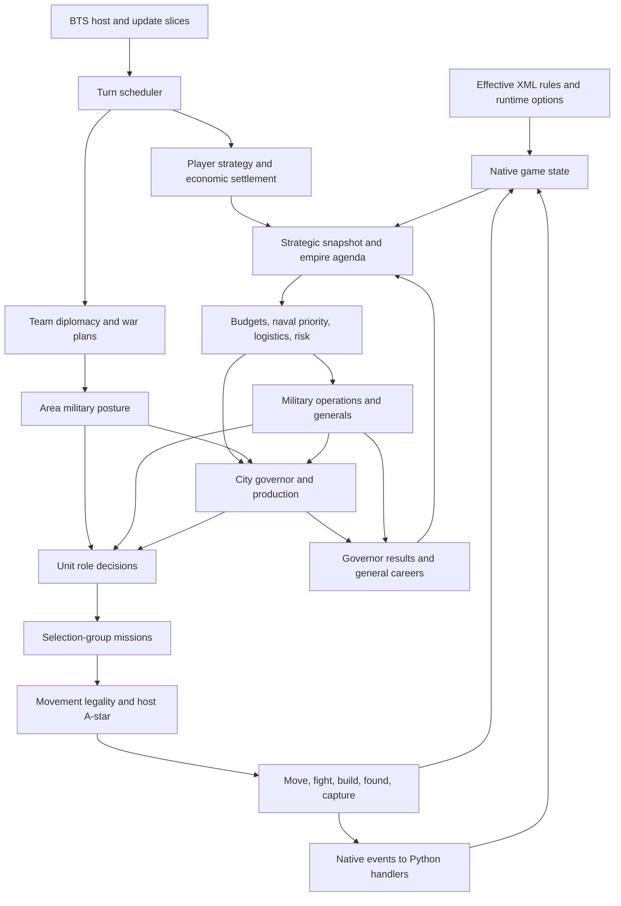
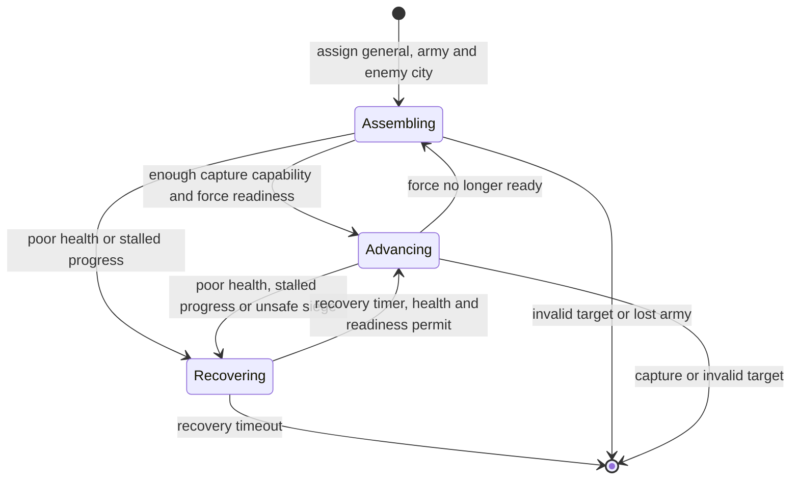

# AI architecture and detailed game logic

This guide describes **the source at GitLab commit `1ab4f99a76adb530f86b278390ab8139ef41cc96`**. The repository owner confirmed that the bundled `Assets/CvGameCoreDLL.dll` is older than the source. Consequently, the behavior below is a source-derived prediction, not a description verified against that binary. The checked-in DLL's SHA-256 is `65388986f4b5190354217ce041bf65b19a99c3701ea62daf30d9f9281ac4ba64`; its producing source revision is unknown. A rebuilt DLL with recorded provenance is required for source-to-game comparisons.

The [whole-tree assessment](REVIEW.md) covers the inventory, Python/XML integration and reproduced findings. The [game-flow specification](GAMEFLOW_MODEL.md) defines a prospective simulator. This guide expands the behavioral model. Source links are pinned; statements about conditional behavior assume its native guards and configured options allow it.

## 1. The architecture is a stateful hierarchy with several decision mechanisms

The core is a Civilization IV: Beyond the Sword native game DLL, extended by Python handlers and XML rules. The BTS executable supplies hosting, interfaces and some algorithms. Python is consequential gameplay code, but most strategic and tactical AI lives in C++.



There is no single global optimizer. Some decisions rank weighted utilities; others execute a sequence of guarded actions and return on the first success. Stateful plans, cached observations, timers, stochastic checks and hard emergency overrides connect them. This distinction matters: a globally highest-scoring building can lose to an earlier defense or worker requirement.

The main state owners are `CvGame`, `CvTeam`, `CvPlayer`, `CvCity`, `CvUnit`, `CvSelectionGroup`, `CvMap` and `CvPlot`. The corresponding `*AI` classes choose actions using that state. `CvInfos` and the XML loader supply rule definitions; `Cy*` wrappers expose native objects to Python. Selection groups, rather than individual units alone, own mission queues and much movement coordination.

### The distinct categories of AI state

| Category | Scope | Values or responsibility |
|---|---|---|
| Leader personality | Player | XML flavors, war probabilities, attitudes, contact cadence, attack-odds variation |
| Strategic flags | Player; multiple can coexist | Early aggression, concentrated conquest, alert levels, defense, unit modernization, fast/mobile warfare, air warfare, nuclear posture, production, religion, espionage |
| Victory stages | Player; multiple flags | Four stages each for space, conquest, culture, domination and diplomacy in `AI_Defines.h`; religious-victory logic has additional player routines |
| Empire agenda | One current player agenda | Survive, recover, expand land, expand maritime, consolidate, power spike, conquest, science, culture |
| War plan | Team-to-team relation | Attacked recently, attacked, preparing limited/total war, limited/total war, dogpile, or no plan |
| Area posture | Team and geographic area | Offensive, defensive, massing, assault, assault massing, assault assist, neutral |
| Local governor | City | Steward plus eight specializations, with terms, performance and reputation |
| Military operation | Selected army | Target city, general, desired roles, readiness, assembling/advancing/recovering state |
| General doctrine | Operational general | Conqueror, logistician, raider, colonizer |
| Unit role | Unit; group head dispatches | 41 `UNITAI_*` values, including unknown and animal |
| Automation mode | Automated units, including humans' units | Build, network, city, explore, religion |
| Mission and mission intent | Selection group | Concrete command plus coordination purpose, target plot/unit and flags |

These are separate dimensions. A science-agenda player can retain a defensive war plan and field a city-attack unit. An assault transport can change role when its current job ceases to fit. Declaring “the AI is in conquest mode” loses information needed to explain its choices.

Sources: [strategic and victory flags](https://gitlab.com/aretemaxxing-group/rise-of-mankind/-/blob/1ab4f99a76adb530f86b278390ab8139ef41cc96/Assets/CvGameCoreDLL/AI_Defines.h#L17), [unit roles](https://gitlab.com/aretemaxxing-group/rise-of-mankind/-/blob/1ab4f99a76adb530f86b278390ab8139ef41cc96/Assets/CvGameCoreDLL/CvEnums.h#L1358), [war and area types](https://gitlab.com/aretemaxxing-group/rise-of-mankind/-/blob/1ab4f99a76adb530f86b278390ab8139ef41cc96/Assets/CvGameCoreDLL/CvEnums.h#L1753), [operations and agendas](https://gitlab.com/aretemaxxing-group/rise-of-mankind/-/blob/1ab4f99a76adb530f86b278390ab8139ef41cc96/Assets/CvGameCoreDLL/CvPlayerAI.h#L47).

## 2. Turns have three different clocks

Distinguish the **global turn number**, a **player's active action interval**, and **host update slices**. Movement can require many update slices. A player economic turn does not occur at the same boundary in every game mode.

### Global scheduler

[CvGame::update](https://gitlab.com/aretemaxxing-group/rise-of-mankind/-/blob/1ab4f99a76adb530f86b278390ab8139ef41cc96/Assets/CvGameCoreDLL/CvGame.cpp#L2146) reconciles the active-player count with living players' active flags. When nobody is active, subject to the PBEM guard, it calls `doTurn`. It then updates scores, war, movement, timers and work assignment. A simulator must retain active flags as well as the aggregate count.

[Global rollover](https://gitlab.com/aretemaxxing-group/rise-of-mankind/-/blob/1ab4f99a76adb530f86b278390ab8139ef41cc96/Assets/CvGameCoreDLL/CvGame.cpp#L5916) has this order:

1. Emit `BeginGameTurn` with the old turn number; update caches, scores and deals.
2. Process alive teams and the map.
3. Process barbarian creation, global warming, holy cities, corporation headquarters and votes.
4. Emit `PreEndGameTurn`; process autoplay countdown/revival.
5. Emit `EndGameTurn`, still with the old turn number.
6. Increment game turn and elapsed turns.
7. Activate players or teams according to turn mode.
8. Test victory, notify the host and perform autosave work.

Thus `EndGameTurn` is not simply “after every effect bearing this numeric turn.” Activation itself can execute a player's economy in simultaneous-player mode, before the subsequent victory check.

### Activation and settlement by mode

| Mode | Player activation after the initial-turn guard | Player deactivation |
|---|---|---|
| Sequential | Refresh unit/group turn state; allow actions | Run player economy/cities; activate next living player |
| Simultaneous players | Run player economy/cities, then unit/group refresh | End activity without repeating the sequential settlement branch |
| Simultaneous teams | Activate the selected team's players; uses non-simultaneous-player settlement semantics | Settle players and hand off when the team finishes |

[setTurnActive](https://gitlab.com/aretemaxxing-group/rise-of-mankind/-/blob/1ab4f99a76adb530f86b278390ab8139ef41cc96/Assets/CvGameCoreDLL/CvPlayer.cpp#L12152) also contains guards for `bDoTurn`, initial elapsed turns and host modes. Those must survive any extraction. The source's first-team selection has the independently reproduced **team-0-only bug** discussed in [the review](REVIEW.md): a misplaced `break` can leave no team active when team 0 is dead. This finding applies to the source; the older DLL has not been checked for it.

### Player economy and city order

[Player settlement](https://gitlab.com/aretemaxxing-group/rise-of-mankind/-/blob/1ab4f99a76adb530f86b278390ab8139ef41cc96/Assets/CvGameCoreDLL/CvPlayer.cpp#L3916) is ordered as follows:

```text
BeginPlayerTurn
  caches / deal verification
  AI_doTurnPre
    strategic context -> agenda -> research -> commerce
    -> military operations -> civics -> religion
  counters / work assignment / commerce validation
  gold -> research -> espionage
  centralized-production call [currently a no-op]
  empire gold-hurry allocation
  each city's doTurn
  optional DCM opportunity fire and active defense
  golden-age/anarchy timers, civics, trade routes, war weariness
  random events and history
  AI_doTurnPost: diplomacy and launch checks
EndPlayerTurn
```

**The centralized-production call is inactive.** [AI_doCentralizedProduction](https://gitlab.com/aretemaxxing-group/rise-of-mankind/-/blob/1ab4f99a76adb530f86b278390ab8139ef41cc96/Assets/CvGameCoreDLL/CvPlayerAI.cpp#L1676) returns unconditionally at line 1697 before its wonder-planning body. A call graph that merely follows function names would falsely assign it an active strategic role. Gold hurry is active: it repeatedly scores legal city/hurry candidates, preserves a reserve, breaks equal positive city scores by lower city ID, and caps purchases at `min(8, number_of_cities)` ([implementation](https://gitlab.com/aretemaxxing-group/rise-of-mankind/-/blob/1ab4f99a76adb530f86b278390ab8139ef41cc96/Assets/CvGameCoreDLL/CvPlayerAI.cpp#L500)).

[City settlement](https://gitlab.com/aretemaxxing-group/rise-of-mankind/-/blob/1ab4f99a76adb530f86b278390ab8139ef41cc96/Assets/CvGameCoreDLL/CvCity.cpp#L1149) runs defense/turn flags, city AI, production validation, growth, culture and plot culture, production, decay, religion, great people, meltdown, espionage visibility, worked improvements, timers/celebration, and `cityDoTurn`. Production completion can synchronously invoke Python. A building's native effects and Python upgrade-removal effects can therefore alter the state observed by later cities in the same player loop.

### Unit scheduling

[updateMoves](https://gitlab.com/aretemaxxing-group/rise-of-mankind/-/blob/1ab4f99a76adb530f86b278390ab8139ef41cc96/Assets/CvGameCoreDLL/CvGame.cpp#L7212) visits alive active players; simultaneous turns shuffle player order using the gameplay RNG. [AI_unitUpdate](https://gitlab.com/aretemaxxing-group/rise-of-mankind/-/blob/1ab4f99a76adb530f86b278390ab8139ef41cc96/Assets/CvGameCoreDLL/CvPlayerAI.cpp#L1533) orders nonhuman selection groups by movement priority, preserving collection order within a priority. Groups may die or split during earlier updates, so references are checked again.

[The group update loop](https://gitlab.com/aretemaxxing-group/rise-of-mankind/-/blob/1ab4f99a76adb530f86b278390ab8139ef41cc96/Assets/CvGameCoreDLL/CvSelectionGroupAI.cpp#L181) continues while it has queued group attacks or is ready to move. It delegates to the head unit and processes resulting missions. A loop exceeding 100 iterations cancels the attack and finishes members' moves. The eventual auto-move completion can deactivate an AI player, which in sequential play triggers its economic settlement. This is a scheduler loop with mutable collections, not one decision per unit per turn.

## 3. Empire strategy: evidence, agenda, policy consumers

[AI_doTurnPre](https://gitlab.com/aretemaxxing-group/rise-of-mankind/-/blob/1ab4f99a76adb530f86b278390ab8139ef41cc96/Assets/CvGameCoreDLL/CvPlayerAI.cpp#L423) invalidates relevant caches and, for eligible AI players, refreshes strategic context before downstream decisions. [AI_updateAgenda](https://gitlab.com/aretemaxxing-group/rise-of-mankind/-/blob/1ab4f99a76adb530f86b278390ab8139ef41cc96/Assets/CvGameCoreDLL/CvPlayerAI.cpp#L4592) uses city/population counts, finances/runway, settlers and available sites, coastal/trade opportunities, military pressure, existing strategic/victory flags and bad-start evidence.

The agenda is reevaluated on a configured cadence. Emergency conditions, changed war status, changed bad-start evidence, forcing, and missing initial state can bypass that cadence. Hysteresis normally requires a challenger to beat the incumbent by a configured margin. Strike overrides to recovery; sufficiently severe war pressure overrides to survival. Bad-start escape/breakout directives have further conditional overrides.

These are the source's advisory budget vectors; each row sums to 1,000:

| Agenda | Growth | Economy | Military | Expansion | Culture |
|---|---:|---:|---:|---:|---:|
| Survive | 100 | 150 | 650 | 50 | 50 |
| Recover | 180 | 480 | 180 | 110 | 50 |
| Expand land | 220 | 180 | 180 | 370 | 50 |
| Expand maritime | 180 | 260 | 180 | 330 | 50 |
| Consolidate | 360 | 350 | 140 | 100 | 50 |
| Power spike | 140 | 180 | 570 | 60 | 50 |
| Conquest | 100 | 170 | 650 | 40 | 40 |
| Science | 180 | 520 | 160 | 90 | 50 |
| Culture | 180 | 250 | 120 | 50 | 400 |

They are **priority weights, not treasury allocations**. There is no separate research budget axis. Consumers translate these weights into choices: military production probability, settler capacity, cash targets and derived naval/logistics/risk policies. For example, recovery raises the normal cash target by half, science reduces it to three quarters, and survival/conquest raise it to five quarters ([commerce policy](https://gitlab.com/aretemaxxing-group/rise-of-mankind/-/blob/1ab4f99a76adb530f86b278390ab8139ef41cc96/Assets/CvGameCoreDLL/CvPlayerAI.cpp#L16192)).

Results also travel upward. City governors' completed terms and reputation contribute bounded agenda evidence. Completed general careers contribute doctrine-specific evidence, weighted by authority/confidence and decayed over a game-speed-scaled horizon. Active generals are excluded from the completed-career agenda contribution. These mechanisms adapt scalar heuristics; they are not proof of an integrated trained machine-learning model.

### Research, commerce, civics and religion

* **Research:** [AI_bestTech](https://gitlab.com/aretemaxxing-group/rise-of-mankind/-/blob/1ab4f99a76adb530f86b278390ab8139ef41cc96/Assets/CvGameCoreDLL/CvPlayerAI.cpp#L5233) considers unreached, ever-researchable technologies within the path-length limit and at most one era ahead. It computes prerequisite paths and values unlocks. [AI_techValue](https://gitlab.com/aretemaxxing-group/rise-of-mankind/-/blob/1ab4f99a76adb530f86b278390ab8139ef41cc96/Assets/CvGameCoreDLL/CvPlayerAI.cpp#L5374) incorporates existing progress, trade capabilities, terrain/resource improvements, health, units/buildings and configured randomness. Multi-step targets receive an additional prerequisite-completion-cost adjustment. Production-chain readiness prevents every nominal unlock being treated as immediately useful. Gameplay and asynchronous evaluations can use different RNG streams.
* **Commerce:** cash reserves, expected research completion cost, era and war state interact with research/culture/espionage sliders. At the opening, a solvent peaceful empire can target zero reserve to accelerate research. Culture responds to happiness and cultural victory stages. Espionage spending also ranks foreign teams. “Always maximize science” does not describe this policy.
* **Civics:** [AI_doCivics](https://gitlab.com/aretemaxxing-group/rise-of-mankind/-/blob/1ab4f99a76adb530f86b278390ab8139ef41cc96/Assets/CvGameCoreDLL/CvPlayerAI.cpp#L16681) evaluates legal candidates once, chooses the best in each civic category, sums current and candidate packages, then applies an anarchy/horizon/switch-threshold test. It is not exhaustive optimization of every cross-category combination. Cooldowns inhibit repeated switches.
* **Religion:** [AI_doReligion](https://gitlab.com/aretemaxxing-group/rise-of-mankind/-/blob/1ab4f99a76adb530f86b278390ab8139ef41cc96/Assets/CvGameCoreDLL/CvPlayerAI.cpp#L16774) respects conversion legality and timers, evaluates the preferred religion and converts when allowed. Separate religious-victory and inquisition state influences other consumers.
* **Military maintenance:** [AI_doMilitary](https://gitlab.com/aretemaxxing-group/rise-of-mankind/-/blob/1ab4f99a76adb530f86b278390ab8139ef41cc96/Assets/CvGameCoreDLL/CvPlayerAI.cpp#L16140) updates operations, may disband costly units during financial trouble when there are no war plans, and changes attack-odds bias using leader randomness and agenda offsets.

## 4. Cities: local specialization inside an ordered production policy

[City AI](https://gitlab.com/aretemaxxing-group/rise-of-mankind/-/blob/1ab4f99a76adb530f86b278390ab8139ef41cc96/Assets/CvGameCoreDLL/CvCityAI.cpp#L185) updates plot/build/worker/route evidence, then governor, panic, drafting, hurry and emphasis for AI cities. Human automation follows separate paths. Citizen allocation respects legal plots, specialist constraints and population capacity; it removes poor assignments, adds better ones and can juggle assignments rather than simply sort raw tile yields.

[Nine governor types](https://gitlab.com/aretemaxxing-group/rise-of-mankind/-/blob/1ab4f99a76adb530f86b278390ab8139ef41cc96/Assets/CvGameCoreDLL/AICityGovernorPolicy.h#L7) have explicit eligibility and utility functions:

| Governor | Main evidence |
|---|---|
| Steward | Universally eligible balanced fallback |
| Agriculturalist | Good food plots, food potential, health and happiness capacity |
| Harbormaster | Water plots plus seafood, foreign trade or multiple trade routes |
| Merchant | Capital connectivity, commerce and trade |
| Industrialist | Production with adequate food potential |
| Scholar | Commerce with adequate food potential |
| Curator | Cultural pressure |
| Castellan | Danger or severe cultural pressure |
| Colonial | Distance maintenance or disconnected status |

[Governor appointments](https://gitlab.com/aretemaxxing-group/rise-of-mankind/-/blob/1ab4f99a76adb530f86b278390ab8139ef41cc96/Assets/CvGameCoreDLL/CvCityAI.cpp#L11031) persist through a term. The source computes a 20–40-turn term from local deficits; this helper does not scale it by game speed. It records disruptions from danger/disorder and evaluates prosperity change at expiry. An ineligible or negatively performing incumbent can be replaced. Reputation uses a smoothed performance update; completed-term confidence is capped. The context sums available city-assigned plots' potential, so it must not be confused with actual currently worked output.

[AI_chooseProduction](https://gitlab.com/aretemaxxing-group/rise-of-mankind/-/blob/1ab4f99a76adb530f86b278390ab8139ef41cc96/Assets/CvGameCoreDLL/CvCityAI.cpp#L705) is a long priority chain with early returns. Before normal selection it can retain nearly finished orders, safe food production or a safe limited wonder; anarchy returns early. Python can claim the choice, but the native path verifies that actual production exists. Barbarian, rebel and human-automation branches differ.

The ordinary city path includes undefended-city responses, strike responses, settler escort needs, basic worker/work-boat requirements, training infrastructure and production investment, then context-sensitive naval, expansion, defense, religious, economic and victory production. Later fallbacks do not compete on equal footing with earlier successful clauses. Foundation worker requirements precede much optional development. Operation role targets enter the unit-demand calculation ([role-demand integration](https://gitlab.com/aretemaxxing-group/rise-of-mankind/-/blob/1ab4f99a76adb530f86b278390ab8139ef41cc96/Assets/CvGameCoreDLL/CvCityAI.cpp#L3629)).

An illustrative interconnection: an isolated coastal empire selects maritime expansion; its naval priority raises desired transports and warships; coastal cities build appropriate ships or naval infrastructure; a settler compares reachable land sites with overseas sites; transport code coordinates cargo and escort readiness. Each edge has guards. Better overseas site value alone does not guarantee a successful founding mission.

## 5. Military operations and generals

[AI_updateMilitaryOperations](https://gitlab.com/aretemaxxing-group/rise-of-mankind/-/blob/1ab4f99a76adb530f86b278390ab8139ef41cc96/Assets/CvGameCoreDLL/CvPlayerAI.cpp#L15613) manages selected city-attack groups and their target cities. New operations require an actual war; their cap is `min(3, 1 + city_count / 6)`. The code can commission a general unit for an otherwise eligible seed army, rather than depending exclusively on combat-earned great generals.

An operation records target owner/ID/coordinates, army group, general identity, desired role counts, personality, authority, performance, progress distance, health, siege history and state timestamps. Validity checks remove operations whose target has changed identity/owner, whose war has ended, or whose army no longer exists.

| Doctrine | Initial force modification |
|---|---|
| Conqueror | More city attackers |
| Logistician | Extra counter unit and reserves |
| Raider | Pillagers and fewer city attackers, within a floor |
| Colonizer | City defenders and a worker |



This diagram summarizes conditions; the exact ordered checks remain authoritative. Readiness is not raw stack size: it counts healthy field units and units capable of capturing, excludes inappropriate units, and compares against target defenses when the target is known. The normal force-ready gate needs at least two capturers. For a distant unknown target it uses a composition threshold rather than a fabricated defender-strength estimate. Embarked armies reset progress clocks so a sea journey is not automatically classified as a stalled land siege.

Adjacent siege logic observes wall damage, health loss and waiting time. A weak force taking losses or waiting too long can recover. While assembling or recovering, [AI_operationMove](https://gitlab.com/aretemaxxing-group/rise-of-mankind/-/blob/1ab4f99a76adb530f86b278390ab8139ef41cc96/Assets/CvGameCoreDLL/CvUnitAI.cpp#L2097) runs before ordinary role dispatch: it permits a high-odds local attack, otherwise retreats/heals/waits. Advancing falls through into ordinary tactical code, augmented by operation targets and siege urgency. Operations therefore constrain existing unit AI rather than replacing it wholesale.

Reinforcement code protects local needs: a singleton must be sufficiently healthy, not cargo, not already operational, outside local danger, and must not strip a city with at most two defenders. Eligible units join or move toward the selected army ([reinforcement routing](https://gitlab.com/aretemaxxing-group/rise-of-mankind/-/blob/1ab4f99a76adb530f86b278390ab8139ef41cc96/Assets/CvGameCoreDLL/CvUnitAI.cpp#L2119)).

Outcomes alter the world as well as future preferences. When the owned target is captured and the army is nearby, the operation can reduce occupation time, never below one through that reduction, and lower revolution index; authority/performance improve and the operation concludes. A missing general can be recreated at the capital following a bounded survival roll, with authority/performance penalties. These are concrete source mechanics that a policy-only simulator would miss.

## 6. Unit behavior categories and mission execution

[AI_update](https://gitlab.com/aretemaxxing-group/rise-of-mankind/-/blob/1ab4f99a76adb530f86b278390ab8139ef41cc96/Assets/CvGameCoreDLL/CvUnitAI.cpp#L114) first handles an optional Python override, domain/cargo circumstances, after-attack behavior and automation. Operational waiting/recovery then precedes normal role dispatch.

| Family | `UNITAI_` suffixes | Typical responsibility |
|---|---|---|
| Fallback and wildlife | UNKNOWN, ANIMAL | Fallback handling; animal behavior |
| Economy | SETTLE, WORKER, WORKER_SEA | Found cities; improve/connect land; water improvements |
| Land offense | ATTACK, ATTACK_CITY, ATTACK_CITY_LEMMING, COLLATERAL, PILLAGE, PARADROP | Field combat, city assaults, siege/collateral, raids, airborne movement |
| Land security | RESERVE, COUNTER, CITY_DEFENSE, CITY_COUNTER, CITY_SPECIAL | Mobile defense, counters, garrisons; city counter/special share a dispatch helper |
| Exploration | EXPLORE, EXPLORE_SEA | Land/sea discovery |
| Religion and espionage | MISSIONARY, SPY | Religion/corporation spread and conditional inquisition; espionage actions |
| Great people | PROPHET, ARTIST, SCIENTIST, GENERAL, MERCHANT, ENGINEER | Specialized missions; operational or ordinary general behavior |
| Naval combat | ATTACK_SEA, RESERVE_SEA, ESCORT_SEA, PIRATE_SEA | Attack, protect, escort, raid |
| Naval transport | ASSAULT_SEA, SETTLER_SEA, MISSIONARY_SEA, SPY_SEA | Deliver armies, settlements, missionaries or spies |
| Naval platforms | CARRIER_SEA, MISSILE_CARRIER_SEA | Position platforms and support their cargo |
| Air and nuclear | ATTACK_AIR, DEFENSE_AIR, CARRIER_AIR, MISSILE_AIR, ICBM | Air strikes, interception, carrier aviation, missiles and nuclear attacks |

The [generated dispatch map](unit-role-dispatch.json) links all 41 enum values to their dispatch cases and called behavior methods. Role names describe jobs rather than immutable unit types; one XML unit can serve different roles.

### Settlers and workers

[Settlers](https://gitlab.com/aretemaxxing-group/rise-of-mankind/-/blob/1ab4f99a76adb530f86b278390ab8139ef41cc96/Assets/CvGameCoreDLL/CvUnitAI.cpp#L1281) first have a special no-cities founding path, then danger handling. They evaluate cached sites using reachable safe paths, compare local and other-area values, consider transport loading, escort/defense conditions and founding legality. A settler with no viable site can eventually be scrapped, subject to age, cargo and pickup guards. Site valuation, settler production and delivery are distinct policies and should have distinct tests.

[Workers](https://gitlab.com/aretemaxxing-group/rise-of-mankind/-/blob/1ab4f99a76adb530f86b278390ab8139ef41cc96/Assets/CvGameCoreDLL/CvUnitAI.cpp#L1541) use a priority chain: retreat from unsuitable/threatened positions; consider colony transport without taking the last needed local worker in the early loading branch; connect an already improved resource; improve valuable resources; connect cities; improve local plots; consider forts/canals/airbases; redistribute to other cities; build routes and irrigation; then airlift/transport, fallback improvement or retirement. Higher logistics priority changes later route choices. The policy is not “choose the largest yield increase anywhere.”

### City attacks and naval delivery

[City attackers](https://gitlab.com/aretemaxxing-group/rise-of-mankind/-/blob/1ab4f99a76adb530f86b278390ab8139ef41cc96/Assets/CvGameCoreDLL/CvUnitAI.cpp#L2794) can reinforce operations, heal, split/merge groups, guard cities, choose a target, load coastal transport, bombard, attack, pillage, choke or wait for joiners. Stack comparisons, capturer availability, city defense reduction and siege urgency matter. The initial readiness check requiring two capturers has a later tactical override for a strong near-target stack with at least one capturer; it is not a universal prohibition on one-capturer assaults.

[Assault transports](https://gitlab.com/aretemaxxing-group/rise-of-mankind/-/blob/1ab4f99a76adb530f86b278390ab8139ef41cc96/Assets/CvGameCoreDLL/CvUnitAI.cpp#L7071) distinguish empty/full cargo, escorts, invasion versus reinforcement, area posture and danger in port. Incorrect civilian cargo can be unloaded in friendly ports. [Settler transports](https://gitlab.com/aretemaxxing-group/rise-of-mankind/-/blob/1ab4f99a76adb530f86b278390ab8139ef41cc96/Assets/CvGameCoreDLL/CvUnitAI.cpp#L7757) distinguish settlers, workers and defenders; a hull filled entirely with settlers/workers can unload in port, while a settlement voyage can depart with a settler and defender when no further loading missions target it. Empty surplus settler transports can convert to assault roles when area strategy calls for it.

Mission intent participates in coordination: pickup/loading/group-target counts can prevent duplicate commitments or make an army wait. Headless state must include these intentions and targets, not just the visible destination coordinate.

## 7. Pathfinding: legality, movement accounting, preferences and host search

There are four distinct questions:

1. Can this unit/group enter or pass through a plot?
2. How much movement does that edge consume?
3. How desirable is that route for this mission?
4. Which candidate does the host's search return, including ties and reused state?

The repository implements much of the first three. BTS supplies the `FAStar` search interface. [Map setup](https://gitlab.com/aretemaxxing-group/rise-of-mankind/-/blob/1ab4f99a76adb530f86b278390ab8139ef41cc96/Assets/CvGameCoreDLL/CvMap.cpp#L247) registers separate path, interface-path, step, route, border, area and plot-group finders. They are not interchangeable. A connectivity route search does not establish that an army can traverse the same route.

### Legality and edge movement

[canMoveInto](https://gitlab.com/aretemaxxing-group/rise-of-mankind/-/blob/1ab4f99a76adb530f86b278390ab8139ef41cc96/Assets/CvGameCoreDLL/CvUnit.cpp#L2591) considers impassable terrain/features and enabling technologies, domain, friendly coastal ports, transport loading, air capacity, animal restrictions, capture ability, attack state, visible defenders, territory access, war/declaration conditions and optional Python restrictions. [movementCost](https://gitlab.com/aretemaxxing-group/rise-of-mankind/-/blob/1ab4f99a76adb530f86b278390ab8139ef41cc96/Assets/CvGameCoreDLL/CvPlot.cpp#L2763) then considers terrain/features, hills, discounts, double movement, base moves, routes, team route modifiers and bridge/river crossing. Route endpoints both matter; the result is clamped to at least one internal movement unit.

Observation semantics are asymmetric. Human movement estimates into unrevealed plots receive special treatment; several AI path/legality branches use actual plot/team information where humans use revealed information. The correct simulator boundary is **the information actually consumed by each production routine**. Imposing a uniformly fair fog-of-war model would change the source policy, just as exposing all hidden state indiscriminately would.

### Path callbacks

* [pathDestValid](https://gitlab.com/aretemaxxing-group/rise-of-mankind/-/blob/1ab4f99a76adb530f86b278390ab8139ef41cc96/Assets/CvGameCoreDLL/CvGameCoreUtils.cpp#L1601) checks destination/domain/area conditions, danger for vulnerable AI groups, and movement/attack or amphibious cargo legality as applicable.
* [pathValid](https://gitlab.com/aretemaxxing-group/rise-of-mankind/-/blob/1ab4f99a76adb530f86b278390ab8139ef41cc96/Assets/CvGameCoreDLL/CvGameCoreUtils.cpp#L2007) checks transit constraints: sea corner cutting, safe-territory and no-enemy-territory flags, vulnerable-group danger, and movement-through/attack-through permissions. Some checks apply to the **from-node**, with separate destination validation.
* [pathAdd](https://gitlab.com/aretemaxxing-group/rise-of-mankind/-/blob/1ab4f99a76adb530f86b278390ab8139ef41cc96/Assets/CvGameCoreDLL/CvGameCoreUtils.cpp#L2141) records remaining movement in `m_iData1` and turn count in `m_iData2`. The start is turn 1. A depleted parent starts the next movement turn; member movement costs determine the group's remaining allowance. `MOVE_MAX_MOVES` has its own initialization rule.
* [pathHeuristic](https://gitlab.com/aretemaxxing-group/rise-of-mankind/-/blob/1ab4f99a76adb530f86b278390ab8139ef41cc96/Assets/CvGameCoreDLL/CvGameCoreUtils.cpp#L1727) uses wrapped step distance times movement weight.
* [pathCost](https://gitlab.com/aretemaxxing-group/rise-of-mankind/-/blob/1ab4f99a76adb530f86b278390ab8139ef41cc96/Assets/CvGameCoreDLL/CvGameCoreUtils.cpp#L1733) adds route preference beyond edge movement: ending a turn in foreign territory, environmental damage, extra plot costs, exposure/defense, and attack approach/river penalties under their guards. Threat avoidance is weighted, not necessarily forbidden.

[Threat cost](https://gitlab.com/aretemaxxing-group/rise-of-mankind/-/blob/1ab4f99a76adb530f86b278390ab8139ef41cc96/Assets/CvGameCoreDLL/AIPathPolicy.h#L36) applies one bounded destination multiplier: weight 2 uses ×2 in enemy territory or ×4/3 adjacent; weight 3 uses ×3 or ×3/2. It does not compound once per hostile neighboring plot. War-plan territory and actual-war adjacency are not identical predicates in the caller.

[generatePath](https://gitlab.com/aretemaxxing-group/rise-of-mankind/-/blob/1ab4f99a76adb530f86b278390ab8139ef41cc96/Assets/CvGameCoreDLL/CvSelectionGroup.cpp#L5375) supplies the group, flags and reuse choice to the host, returns success and obtains turns from the final node. `getPathEndTurnPlot` allows a long-term destination to yield only this turn's movement endpoint. A replacement A* can find a legal path yet disagree on tie-breaking, remaining movement, chosen endpoint or cache reuse; engine path traces are necessary before claiming compatibility.

## 8. Combat and capture are transitions, not just odds

Tactical AI estimates odds/stack strength to choose an action; [resolveCombat](https://gitlab.com/aretemaxxing-group/rise-of-mankind/-/blob/1ab4f99a76adb530f86b278390ab8139ef41cc96/Assets/CvGameCoreDLL/CvUnit.cpp#L1179) performs the resulting combat. It obtains attacker/defender strength and firepower, applies collateral effects, draws combat rounds, handles first strikes, damage, withdrawal, combat limits, flanking and experience. Death/capture and movement completion have further surrounding logic in `updateCombat` and native acquisition routines. Air, interception, nuclear and DCM bombardment paths require separate coverage.

A combat-limit siege unit is not interchangeable with a capturer. An odds-only outcome sampler would lose collateral order, withdrawal draws, surviving damage, experience and downstream Python callbacks. To reproduce a combat exactly, retain rule modifiers, chosen defender, first-strike state, RNG consumption and ordered side effects.

City acquisition then reaches Python systems such as conquest research and revolution bookkeeping. Capturing a city can change technology, ownership, trade connectivity, instability, army grouping and operation performance. This is why “combat test passed” is insufficient evidence for a complete conquest transition.

## 9. Diplomacy has relationship, transaction and war-planning layers

### Attitude and memory

[AI_getAttitudeVal](https://gitlab.com/aretemaxxing-group/rise-of-mankind/-/blob/1ab4f99a76adb530f86b278390ab8139ef41cc96/Assets/CvGameCoreDLL/CvPlayerAI.cpp#L7497) combines leader base attitude, handicap, AI peace-weight/warmonger relations, rank, border tension, war/peace history, religions, resources, open borders, defensive pacts, vassal relations, shared wars, favorite civic, trade, rival trade, remembered actions, colony and revolution effects. Forced same-team/voluntary-vassal and barbarian cases return special values before ordinary cached evaluation.

[Thresholds](https://gitlab.com/aretemaxxing-group/rise-of-mankind/-/blob/1ab4f99a76adb530f86b278390ab8139ef41cc96/Assets/CvGameCoreDLL/CvPlayerAI.cpp#L7463) are: friendly ≥10, pleased 3–9, cautious −2–2, annoyed −9–−3, furious ≤−10. Those labels feed other decisions; they do not directly dictate all outcomes. XML leader refusal thresholds and no-war probabilities differ.

### Offers, denials and contacts

[AI_considerOffer](https://gitlab.com/aretemaxxing-group/rise-of-mankind/-/blob/1ab4f99a76adb530f86b278390ab8139ef41cc96/Assets/CvGameCoreDLL/CvPlayerAI.cpp#L9045) checks refusal rules before ordinary value comparison, with separate same-team, gifts, demands, vassal and surrender paths. Each party can value the bundle differently. Existing-deal reconsideration has a 10% value tolerance; new ordinary offers require received value to meet given value. Demands incorporate power, proximity, contact duration and prior grants; repeated recent demands can be refused.

[AI_doDiplo](https://gitlab.com/aretemaxxing-group/rise-of-mankind/-/blob/1ab4f99a76adb530f86b278390ab8139ef41cc96/Assets/CvGameCoreDLL/CvPlayerAI.cpp#L16886) permits a Python override, reevaluates cancelable deals, then considers contacts. It iterates AI counterparts before human counterparts. Leader-defined random intervals, per-contact timers, willingness to talk and per-team human-contact suppression influence which proposals appear. Contact families include alliances/vassalage, religious/civic pressure, joining wars, embargoes, help/tribute, borders/pacts, technology/resources/maps and war trades. Human proposals require an explicit response path; AI-to-AI accepted transactions can be implemented directly.

An agreed deal belongs to native `CvDeal` state; recurring resources, gold, treaty constraints and cancellation are not a single instantaneous utility exchange. Team-level relations and player-level valuations must remain distinct.

### War planning

[AI_doWar](https://gitlab.com/aretemaxxing-group/rise-of-mankind/-/blob/1ab4f99a76adb530f86b278390ab8139ef41cc96/Assets/CvGameCoreDLL/CvTeamAI.cpp#L4495) updates existing plans before considering new wars, and returns for vassals. A Python override can take control. Preparing-limited and preparing-total states can mature after adjusted timers; total-war preparation additionally inspects area posture and power. Unproductive plans can be abandoned; dogpile plans lose their justification when the target's other wars disappear. Member players' peace routines and team-level peace checks also run.

New-war consideration depends on existing commitments, enemy power, finances, modernization needs, aggressive strategy, handicap and RNG. Total, limited and dogpile attempts form an ordered conditional chain. Candidate gates include alive/met status, declaration legality, vassal complications, leader attitude/no-war roll, defensive power and geography. Surviving candidates are ranked with war-start value. Total-war search broadens through proximity passes; dogpile additionally weighs the target's existing enemies' combined power.

Choosing a plan is not necessarily declaring war immediately. Plans influence area posture, target selection, production and movement before formal relations change. A simulator must represent plan state and declared-war state separately, including the timers between them.

## 10. Python/XML connections that alter the AI's environment

XML supplies technologies, units, buildings, civics, events, leaders and game options. Effective definitions depend on base BTS data, module order, dependency checks, multi-pass resolution and non-default merging. `Unloaded Modules` is a source inventory category, not automatically active rules. BUG/RevDCM options can subsequently change native defines.

The event route is native reporter → DLL Python interface → BUG event manager → registered Python handlers. Configuration XML also installs gameutils overrides and dynamic exports. Ordinary event fan-out and gameutils return-value selection have different semantics. A static Python import graph alone cannot reconstruct this callback registry.

RoM handlers implement effects such as building upgrades, World Bank grants/interest, terrain-commerce changes, special unit spawning and nuclear-unit removal. Revolution can create players/units and transfer cities. Its `EndPlayerTurn` handling updates the **next** player's revolution state, so effects must not all be attributed to the player whose settlement just ended. Enhanced conquest technology can consume the map RNG during gameplay. These connections are detailed and source-linked in [the assessment](REVIEW.md).

## 11. What the headless model should preserve and test

Use the transition interface in [GAMEFLOW_MODEL.md](GAMEFLOW_MODEL.md), with explicit capability boundaries. Start with small executable source contracts, then a sequential-turn vertical slice; expand only where engine traces establish the next layer.

| Contract | High-value scenario | What a shortcut would miss |
|---|---|---|
| Build provenance | Same source snapshot with old bundled DLL versus a recorded rebuild | Attributing a binary/source mismatch to a simulator defect |
| Scheduler | Sequential and simultaneous-player activation; dead first team | Economics on the wrong boundary or repeated global rollover |
| Agenda | Strike during cadence lock; small score reversals | Emergency bypass or hysteresis |
| Research | Attractive distant unlock with expensive prerequisites | Completion latency and readiness |
| Civic policy | Small utility gain with long anarchy | Package threshold and cooldown |
| City production | Undefended city and attractive wonder; last needed worker | Early-return priority and production legality |
| Governor | Disrupted term; failed incumbent with no eligible specialist | Performance confidence and lawful fallback |
| Operation | Siege-only army; embarked army; stalled weak siege | Capture capability, cargo clock reset and recovery |
| General outcome | Capture with occupation/revolution pressure; lost general | World mutation and survival/career state |
| Transport | Full civilian cargo; escort arrival; competing loading intent | Composition and mission coordination |
| Path | Mixed movement stack, river road, coastal corner, fog, equal-cost alternatives | Per-member accounting, observation rules and host ties |
| Diplomacy | High-value refused trade; old deal; third-party wars on vassal offer | Denial gates, asymmetric valuation and treaty side effects |
| Combat | First strikes, withdrawal, combat limit and collateral | RNG order and surviving state |
| Python | Completion event mutates another building; next-player revolt | Synchronous nested effects and cross-player timing |
| Save/reload | Operation/governor memory, mission intentions and sparse entity IDs | Missing durable state or invalid references |

For each decision trace, capture source/build/rules identity, game turn and scheduler phase, actor and observation inputs, cached-context epoch, candidate legality, decisive branch or score components, RNG stream/draws, emitted mission, resulting state delta and nested callbacks. This makes “why did the AI do this?” answerable without inferring intent from its final move.

Maintain two explicit comparison tracks: **source-contract tests** for this revision, and **engine traces tied to a specific binary**. The existing suite's 12 passing and 2 failing programs exercise useful policy/source contracts, but do not establish end-to-end engine equivalence. Whole-tree structural coverage likewise does not mean every tactical branch has been manually audited. The older bundled DLL must not be used as an unqualified oracle for the newer source.
