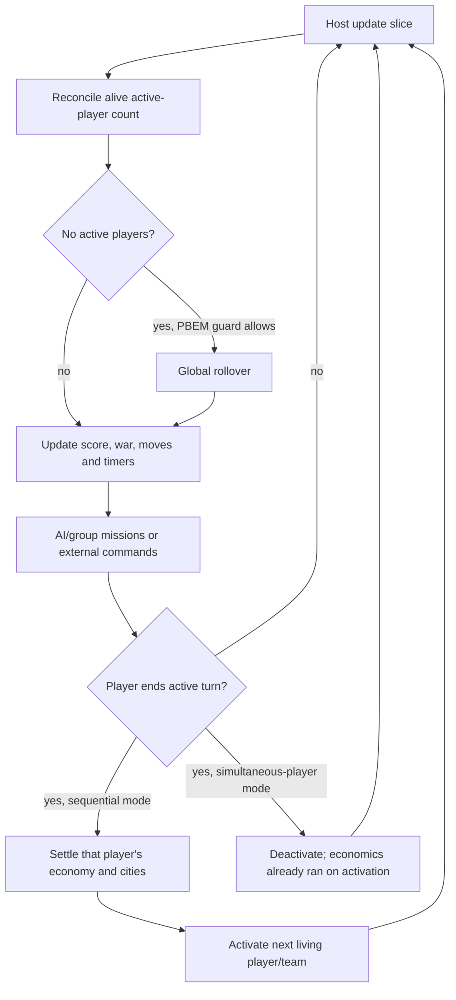
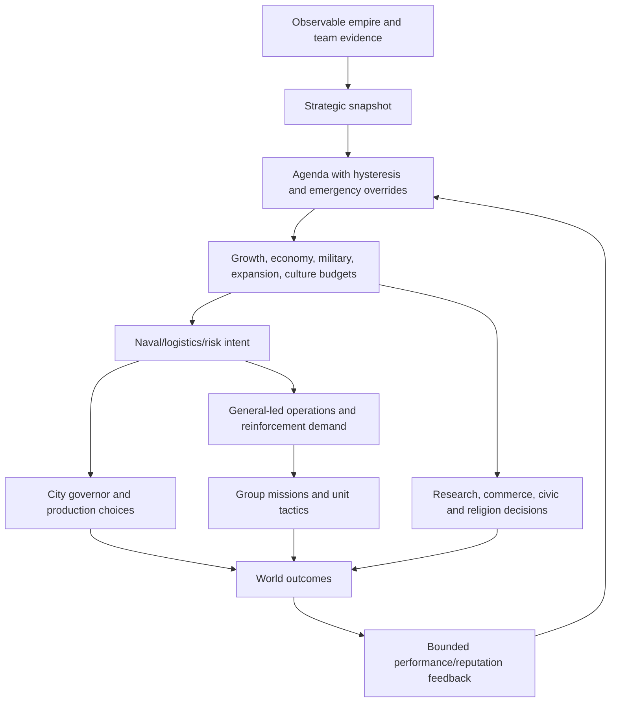

# A testable game-flow model for Rise of Mankind

This is a **proposed simulator specification derived from `main@1ab4f99`**, not an implementation or claim of full engine equivalence. It models the native/Python/XML boundary explicitly. Read [the source assessment](REVIEW.md) for findings and [the architecture diagram](architecture.svg) for component relationships.

**Binary/source distinction:** the repository owner confirmed that the bundled DLL is older than this source. Treat source-contract tests and binary-specific engine traces as separate evidence. Record the source commit, toolchain/build settings and produced DLL hash for a rebuild before using its engine traces as a reference for this specification. The existing DLL's producing revision is unknown; see [provenance](source-binary-provenance.json). The [detailed behavior guide](AI_AND_GAME_LOGIC.md) expands AI, diplomacy, operations and pathfinding.

## 1. Model a transition system with ordered effects

Use

```text
step(S, command, configuration, external_answers)
    -> (S', ordered_trace, pending_decisions, capability_status)
```

`S` is the full simulation state at a named scheduler phase. A command is a user/network/AI input or a scheduler tick. `external_answers` supplies recorded or supported implementations of host-dependent queries, especially pathfinding. `capability_status` must say when an assumption replaces engine behavior. An unsupported operation must fail explicitly, not silently return zero or do nothing.

Native events can invoke Python **synchronously inside the transition that raised them**, and Python can mutate native state or cause further events. Implement a bounded call stack preserving this nesting. A flat queue drained at end of turn would move building effects, technology grants and instability updates to the wrong time. Reserve a separate deterministic queue for genuinely deferred choices, popups, missions and scheduled events.

Separate two questions: (a) does the current implementation behave as recorded, and (b) does it satisfy the intended game rule? Keep a compatibility oracle and desired-behavior assertions. Do not silently “fix” known source defects inside the compatibility model.

## 2. State and identity

| State component | Required contents | Ownership/evidence |
|---|---|---|
| Provenance/rules | Source and DLL hashes; base BTS version/assets; ordered module manifest; effective `Type`→ID tables; resolved rules/defines; callback registry; game options; arithmetic semantics | XML loader, `CvInfos`, `CvGlobals`, BUG/RevDCM |
| Scheduler | Game turn, elapsed turns, update slice, mode, active-player flags and count, end/auto-move flags, current phase, deferred work, autoplay, game state/winner | `CvGame`, `CvPlayer::setTurnActive`, `CvTeam::setTurnActive` |
| RNG | Exact map and Soren RNG states; draw sequence and bounds; any selected map script's separate RNG | `CvRandom`, map scripts, gameplay Python |
| World | Dimensions/wrap, plots, terrain/features/resources, routes/improvements, ownership/culture, area/connectivity, visibility and revealed state | `CvMap`, `CvPlot`, `CvArea`, `CvPlotGroup` |
| Teams | Members, technologies and progress, relations/war plans, contacts, vassalage, espionage, projects, votes, victory countdowns | `CvTeam`/`CvTeamAI` |
| Players | Identity/alive state, entity collections, treasury, commerce percentages, civic/religion/anarchy/golden-age state, research, trade, modifiers and event history | `CvPlayer`/`CvPlayerAI` |
| Cities | Stable ID/owner/coordinates, population/food, culture, buildings, worked plots/specialists, yields/commerce, production queue/progress/overflow, religion/corporations, timers, revolt state | `CvCity`/`CvCityAI` |
| Units/groups | Stable IDs, owner/type/role, position, damage, movement, promotions/experience, transport/cargo, grouping, queued missions, attack/recovery state | `CvUnit`/`CvUnitAI`, selection groups |
| Strategic memory | Agenda/budgets and update policy, operation/general records, governor terms/performance, feedback; explicit cache metadata | Native AI classes and policy headers |
| Python state | BUG/SdToolKit namespaces, Revolution player/city records, spawn/revolt queues, registered handlers and runtime options | `BugData`, `SdToolKitCustom`, `RevData`, `RevInstances` |
| Interaction state | Pending event choice, diplomacy, human revolt response, network/mod message and decision context | Message/popup classes and Python handlers |

Entity collections must be ID maps with iteration semantics, not arrays indexed by population count. IDs may be sparse and may be recycled. A trace key should include run identity, owner, native ID and a generation/founding identity when necessary. Snapshot references need validation after city acquisition, unit death, rebel spawning and group reassignment.

Store rule symbols in interchange data alongside captured numeric IDs. IDs alone are not portable across modular load orders. Record field provenance for XML merges. Derived caches may be rebuilt only at the source's documented lifecycle boundaries; a stale-cache bug is otherwise invisible to a simulator that eagerly recomputes everything.

## 3. Initialization and loading

```text
Load DLL / initialize host interfaces
  -> read native defines and phased info tables
  -> resolve base data + custom MLF order/dependencies/merges/read passes
  -> choose new game or deserialize saved state
  -> generate/import map and allocate players/teams/entities as applicable
  -> once the game context is ready, BUG loads Config/init.xml
  -> construct plugin instances, gameutils handlers, exports and options
  -> run the appropriate load/start events and rebuild transient state
  -> activate the correct player/team set
```

This is a dependency order, not a claim that the proprietary host's entire initialization sequence was executed here. The exact `OnLoad`, `PreGameStart`, `GameStart` and reload sequence needs an engine trace. `BugEventManager` explicitly initializes BUG before the relevant load/pre-game events; `BugInit` checks `isFinalInitialized`.

Two rule-ingestion modes should be explicit:

1. **Reference mode:** import effective tables and callback configuration captured from BTS. Best first option for checking game-flow assumptions without recreating the XML loader.
2. **Standalone mode:** implement base-data fallback, custom MLF ordering, conditional dependencies, non-default merge semantics and later reference-resolution passes. Compare its output field-by-field with a captured reference before trusting it.

Do not interpret `ModularLoading=0` as “load no modules.” This revision uses that branch for custom MLF controls. Do not include `Unloaded Modules` merely because a recursive file scan finds them.

## 4. Scheduler: separate update slices, actions and economic settlement

The source of truth is [CvGame::update](https://gitlab.com/aretemaxxing-group/rise-of-mankind/-/blob/1ab4f99a76adb530f86b278390ab8139ef41cc96/Assets/CvGameCoreDLL/CvGame.cpp#L2146), [CvGame::doTurn](https://gitlab.com/aretemaxxing-group/rise-of-mankind/-/blob/1ab4f99a76adb530f86b278390ab8139ef41cc96/Assets/CvGameCoreDLL/CvGame.cpp#L5916) and [CvPlayer::setTurnActive](https://gitlab.com/aretemaxxing-group/rise-of-mankind/-/blob/1ab4f99a76adb530f86b278390ab8139ef41cc96/Assets/CvGameCoreDLL/CvPlayer.cpp#L12152). A global `turn` is not an atomic “all players choose, then all cities update” operation.



### Mode contract

| Mode | Activation | Deactivation | Global rollover |
|---|---|---|---|
| Sequential players | Set active; after initial game turn run unit/group turn refresh | Run `CvPlayer::doTurn`, then activate next living player | After all are inactive, process global turn and activate first living player |
| Simultaneous players | Shuffle living players using Soren RNG; after initial game turn run player economic turn, then unit refresh | Deactivate without running the sequential economic branch | Once nobody is active, process global turn then activate all living players |
| Simultaneous teams | Activate members of one team; player economics follows the non-simultaneous-player branch | After team finishes, activate next living team | Select first living team; current source has the team-0 defect documented in the review |
| Hotseat/PBEM/Pitboss | Additional human/session/message transitions | Handoff/save/email/network behavior | Explicit host integration; out of scope for first runner |

Preserve guards for initial turn, `bDoTurn=false`, dead players, advanced start, autoplay and worldbuilder. Start with sequential single-player for the runnable subset; keep the other modes in the specification and scenario tests rather than claiming support implicitly.

### Global rollover order

The source's `CvGame::doTurn()` does this, with callbacks using the old turn number until increment:

1. `BeginGameTurn(old_turn)`; caches, score, deal processing.
2. Each alive team's `doTurn`; then map turn processing.
3. Barbarian cities/units, global warming, holy cities, headquarters and diplomacy votes.
4. `PreEndGameTurn(old_turn)`; autoplay countdown/revival work.
5. `EndGameTurn(old_turn)`.
6. Increment game turn and elapsed-turn count.
7. Activate players/teams according to mode. **Activation can itself settle player economics in simultaneous-player mode.**
8. Test victory; host turn/render notifications; autosave.

Consequently, a generic “victory is checked after all new-turn player actions” rule is wrong. Give trace events both game turn and scheduler phase.

### Player economic settlement order

[CvPlayer::doTurn](https://gitlab.com/aretemaxxing-group/rise-of-mankind/-/blob/1ab4f99a76adb530f86b278390ab8139ef41cc96/Assets/CvGameCoreDLL/CvPlayer.cpp#L3916):

```text
BeginPlayerTurn
  -> update caches / verify deals
  -> AI_doTurnPre: context, agenda, research, commerce, military, civics, religion
  -> timers and counters; working-plot assignment; commerce verification
  -> gold -> research -> espionage points
  -> centralized-production call (unconditional early return; no planning)
  -> gold hurry allocation
  -> each city doTurn, in native collection order
  -> optional DCM opportunity fire / active defense
  -> golden-age/anarchy timers; civics verification; trade routes; war weariness
  -> random events -> histories/messages
  -> AI_doTurnPost: diplomacy / launch checks
EndPlayerTurn
```

`BeginPlayerTurn` hooks can already change gold and units before native accounting. In this revision, Revolution's `EndPlayerTurn` logic finds the next player, updates that player's revolution state, and may launch a pending rebellion. It is therefore incorrect to confine all Python side effects to the currently settling player.

### City settlement order

[CvCity::doTurn](https://gitlab.com/aretemaxxing-group/rise-of-mankind/-/blob/1ab4f99a76adb530f86b278390ab8139ef41cc96/Assets/CvGameCoreDLL/CvCity.cpp#L1149):

```text
defense/turn flags -> city AI -> validate production
  -> growth -> city culture -> plot culture
  -> production and synchronous completion effects
  -> production decay -> religion -> great people -> meltdown
  -> espionage visibility -> worked-plot improvement progress
  -> timers / celebration state -> cityDoTurn event
```

Do not reorder production ahead of growth or defer `buildingBuilt` until after the entire player loop. `CvCity::popOrder` emits completion events after native effects; a Python building-upgrade handler can then remove earlier buildings before later queries.

### Movement and combat

`CvGame::updateMoves` drives AI updates; `CvSelectionGroupAI::AI_update` repeatedly invokes group-head decisions and missions while movement remains. `CvUnitAI::AI_update` handles optional Python overrides, transport/domain conditions, after-attack behavior, automation, operational recovery and role-specific choices. Actual movement and combat mutate `CvUnit`/plots and emit further events.

The group loop has a 100-iteration recovery guard that finishes every member's moves. Preserve “made progress / exhausted moves / yielded for a decision / failed” as explicit outcomes. Detect a repeating state/mission/RNG signature; report it with a bounded trace instead of allowing an infinite simulator loop.

## 5. AI planning is a hierarchy with feedback



The concrete budget names/order must come from `AIAgendaBudgetTypes`; interchange fixtures should store symbolic names. Emergency survival/recovery gates retain authority over feedback. Reinforcement accounting must distinguish present units, incoming units and queued production, and must include reachability/delivery horizon. A transport count is not proof a unit can reach an operation.

Reusing production policy headers enables wide parameter sweeps on the host. Keep policy inputs in the same units and arithmetic as production. Record which inputs were measured from an engine snapshot and which were supplied by a simplified world model.

## 6. Ports for a headless harness

| Port | Contract | First implementation |
|---|---|---|
| `RuleRegistry` | Resolved tables, Type IDs, provenance and runtime overrides | Read a versioned BTS export; later validate a standalone loader |
| `WorldState` | Stable identity, typed queries, checked mutations, native iteration order | Small fixtures with explicit capabilities |
| `PolicyKernel` | Call production C++03 policy functions on scalar snapshots | Compile a CLI batch runner; JSON/CSV boundary outside policy code |
| `PythonRuntime` | Existing callback bodies, registration/override/export semantics, Python 2 arithmetic and extension contracts | Targeted source/handler tests with strict adapters; then compatible isolated runtime if available |
| `RandomSource` | Named RNG stream, exact bounds/state/call order | Explicit fixed-width implementation verified against native traces |
| `PathService` | Reachability, cost, path, turns, cargo/diplomatic/terrain constraints | Recorded answers for fixtures; honest unsupported result for unmodeled paths |
| `EventBridge` | Synchronous nested native→Python→native calls; handler order/defaults/exceptions | Traceable dispatcher reproducing BUG semantics |
| `DecisionProvider` | Human popup/event/diplomacy responses as commands | Scripted response policy; pause when a required choice is unspecified |
| `Persistence` | Snapshot/restore native+Python+RNG state and reference validation | Own versioned interchange format, not a claim to parse BTS saves |
| `TraceSink` | Phase, command, effects, state digest and RNG/decision evidence | Append-only JSONL with stable ordering; never consumes RNG |

Presentation services may be sinks where their output does not affect decisions. Screen-originated gameplay commands and active-player events must instead be represented explicitly. Unknown `Cy*` APIs must raise `UnsupportedCapability`, not return permissive fake values.

## 7. Determinism and arithmetic contract

For the Windows target's 32-bit `unsigned long`, [CvRandom::get](https://gitlab.com/aretemaxxing-group/rise-of-mankind/-/blob/1ab4f99a76adb530f86b278390ab8139ef41cc96/Assets/CvGameCoreDLL/CvRandom.cpp#L50) corresponds to:

```text
seed' = (1103515245 * seed + 12345) mod 2^32
draw  = floor((((seed' >> 16) & 65535) * bound) / 65536)
```

`bound` is passed as `unsigned short` in the native API. Preserve conversions and behavior even when the bound is zero. Use explicit `uint32` semantics on hosts where `unsigned long` is 64-bit. This formula is source-derived; reference vectors from the production target should establish equivalence before campaign claims.

Keep map RNG and Soren RNG separate. Enhanced Tech Conquest consumes **map RNG during gameplay**, so it cannot be discarded after map generation. Some map scripts choose a Python RNG; capture the selected script/configuration and its state too.

Python 2 integer `/` and C++ signed `/` have different negative rounding behavior; Python 3 `/` introduces floats. Preserve each source expression's semantics. Match integer widths, truncation, clamps, percentage scaling, overflow behavior that is defined, iteration order and tie-breaking. Where production has undefined behavior, record a defect rather than inventing a portable meaning.

A reproducible run requires more than a seed: source/DLL/rules hashes, resolved options, mode, initial state, player observation masks, input ordering, callbacks and RNG sequence all matter. Match each routine's actual information access, including its AI/human asymmetries. For example, native movement cost and territory checks have human-only revealed-information branches. Neither exposing all hidden state indiscriminately nor imposing a uniformly restricted fog-of-war model reproduces those source semantics. Keep alternative fair-information experiments explicitly separate from compatibility tests.

## 8. Trace format and differential comparison

Proposed JSONL entry:

```json
{
  "trace_schema": 1,
  "run_id": "fixture-bank-sparse-ids",
  "seq": 17,
  "game_turn": 25,
  "slice": 310,
  "phase": "player_settlement.begin_event",
  "player": 0,
  "cause": {"kind": "BeginPlayerTurn", "parent_seq": 16},
  "handler": "RoMEventManager.onBeginPlayerTurn",
  "rng": [],
  "effects": [{"kind": "gold_delta", "player": 0, "delta": 10}],
  "state_before": "sha256:...",
  "state_after": "sha256:...",
  "capabilities": ["economy_fixture", "python_bank_handler"],
  "unsupported": []
}
```

This illustrates the **intended** bank effect for that fixture, not the current sparse-ID behavior. An observed trace must record the actual zero delta. Store the experiment manifest separately and hash it into the trace header. For callbacks, log errors as outcomes. BUG currently catches many exceptions; a simulation can follow that behavior while still failing a “no handler errors” validation gate.

Compare at the first divergent phase: effective rules → preconditions/observations → selected command → RNG draws → effects → state digest. Exclude pointers, wall-clock times and UI-only state from the gameplay digest. Include all state that can influence future decisions. A partial digest is explicitly partial. Compare relevant floating-point values under a documented tolerance; all authoritative integer and identity fields should match exactly.

Do not depend on existing profiler CSVs as complete state snapshots. Extend instrumentation in a separate task to capture the fields needed for each supported slice. Keep logging disabled/enabled runs equivalent in gameplay state and RNG consumption.

## 9. Invariants and targeted tests

| Priority | Test or invariant | Oracle / falsifiable outcome |
|---|---|---|
| P0 | Callback contract | Every active XML callback resolves after BUG exports, with correct argument/result convention; misspelled fixture must fail |
| P0 | Team selection/progress | Lowest-ID team dead, later teams alive: select first living team; never roll global turns repeatedly without a valid handoff |
| P0 | Sparse IDs | Identical city states under dense/sparse IDs produce identical World Bank/Crusade effects |
| P0 | Phase ordering | Sequential economics on deactivation; simultaneous-player economics on activation; event trace matches source order |
| P0 | Active count | After reconciliation, global active count equals alive players with the active flag; dead players do not block progress |
| P0 | Production completion | One completion changes the queue/native state once, emits one event, removes appropriate obsolete buildings and applies Python side effects once |
| P0 | Repeatability | Same manifest/state/commands/host answers yields identical trace and RNG end state |
| P1 | XML resolution | Base + enabled MLF overlays match a captured effective registry; disabled modules never contribute; defaults/arrays/dependencies preserve native semantics |
| P1 | Save/load | Mid-phase supported snapshot round trip matches uninterrupted continuation, including Python state and both RNG streams |
| P1 | Initialization idempotence | Repeated load/reload does not duplicate handlers or building-upgrade lookup pairs |
| P1 | Entity lifecycle | Capture/raze/revolt/death/group reassignment leaves no dangling owner/entity references; recycled IDs do not inherit old identity |
| P1 | Economy | Treasury/research/production changes reconcile to explicit ordered effects; modifiers, hurry, anarchy and event grants applied once |
| P1 | AI boundaries | Existing production-policy clamps, monotonicity, overflow and emergency precedence; paired fixtures differ only in the intended input |
| P1 | Reinforcements | Present/incoming/training are counted once; unreachable or too-late delivery cannot satisfy immediate demand |
| P1 | Victory | Disabled criteria are neutral; enabled criteria conjunctive; equality/one-short boundaries, vassals, countdown reset and tie-break RNG match native logic |
| P1 | Revolution | Next-player update timing, no-revolution option, bribes/spawn queue, identity transfer and script-data persistence |
| P2 | Movement/combat | Paths, cargo, terrain/visibility, attacks, retreats, DCM options and mission progress compared against BTS traces |
| P2 | Map creation | Fixed script/settings/seed gives same topology/resources/start plots and RNG state; inherited map defaults included |
| P2 | Multiplayer | Identical command order and matching client digests; no dependence on UI clocks, local RNG or unordered containers |
| P2 | Telemetry/training | Schema-v4 round trip, run/decision identity, lineage, group split and quantized policy output match; no v3/v4 mixing |

Do not assert simplistic global properties the game does not promise. Gold, population, territory, research and culture can legitimately change through scripted effects and transfers. Assert accounting against the complete effect ledger or subsystem-specific legal bounds, rather than an invented universal conservation law.

## 10. A practical implementation sequence

**Milestone A — rule and policy laboratory.** Resolve the baseline failures, automate the active callback graph and compile the production policy headers into a batch harness. Supply fixture schemas and boundary/property tests. Exit gate: actual policy code executes and active bindings validate. This supports local rule/AI hypotheses, not campaign outcomes.

**Milestone B — one cross-layer slice.** Support a small sequential fixture with two cities, production, bank/upgrade effects, player economics, sparse IDs and deterministic RNG. Execute existing selected Python handler bodies through strict adapters. Replay a captured BTS trace. Exit gate: state/effect/RNG agreement at every supported phase, no swallowed unsupported API calls.

**Milestone C — strategic closed loop.** Add a real legal-action model for research, civics, production, units and geography incrementally; model agenda/governor/operation feedback; compare multiple turns with recorded engine outcomes. An approximate economy or recorded path oracle must remain labeled. Exit gate: predefined scenario corpus passes; unsupported domains remain explicit.

**Milestone D — broader engine equivalence.** Add combat/pathfinding, Revolution, random events, save migrations and alternate turn modes. Use Windows builds and BTS autoruns as the reference. No amount of pure-policy testing alone certifies this milestone.

For experiments, record the hypothesis, treatment, controlled snapshot, supported capabilities, outcome horizon and success metric before running. Settlement comparisons should branch the same save, retain run lineage and use grouped evaluation so related branches cannot leak into both train and test sets. Paired seeds are useful, but branching decisions can consume different RNG draws; choose and document whether you compare ordinary seeded trajectories or recorded exogenous streams. Report uncertainty across multiple starting conditions, not one winning campaign.
