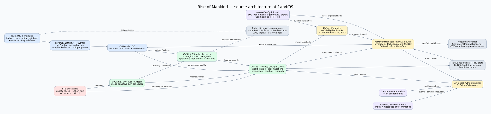

# Rise of Mankind: architecture and source assessment

Reviewed `aretemaxxing-group/rise-of-mankind`, default branch `main`, commit **`1ab4f99a76adb530f86b278390ab8139ef41cc96`**. The checkout is `/workspace/rise-of-mankind`. Review artifacts are outside it, in `/workspace/rom-review`; the game source was not changed.

**The best foundation for a headless simulator is already present: production C++ policy functions, an event-driven Python layer, and declarative XML rules. The difficult part is faithfully reproducing their scheduling, configuration and engine services.** A Python-only model of XML values would miss native AI, combat and turn processing, while a C++-only model would miss Python changes to buildings, money, revolutions and technology.

Start with [the simulator contract](GAMEFLOW_MODEL.md). Use [the interactive source explorer](explorer.html) to search every indexed file and its candidate connections. [The complete file catalog](FILE_CATALOG.md) links each file to this exact GitLab revision.

## Coverage and limits

| Material | Coverage |
|---|---|
| Repository | 7,269 tracked files inventoried |
| Python | All 252 tracked files indexed: 175,678 lines, definitions, imports, event registrations and literal XML lookups |
| XML | All 956 tracked files inspected structurally: 864,873 lines; root/type declarations, callback bindings and plugin bindings indexed |
| Native source | All 277 tracked `.cpp`, `.cc`, `.c`, `.h`, `.inl` files indexed; includes and recognizable qualified methods recorded |
| Behavioral source review | Turn scheduler; player and city phases; AI agenda/operations/governors; XML loading; Python initialization, dispatch and gameplay handlers; event callbacks; persistence/RNG boundaries; telemetry and test tools |
| Existing validation | Entire 14-program host-independent suite executed; **12 passed, 2 failed** |
| Additional diagnostics | Source-fragment reproductions for team scheduling and sparse city IDs; callback binding audit including BUG exports; telemetry schema comparison |
| Archives | Both tar archives cataloged. The SDK archive contains native/toolchain/vendor material, not additional Python/XML gameplay files. `Docs/old_chat.tar.gz` contains 14 Markdown files and one historical test script. Archive members are not counted as active source or used to replace `main`. |

This is a whole-tree structural assessment with focused behavioral review, **not a claim that 1.36 million lines were manually audited or that every gameplay path was executed**. The source explorer is a lexical dependency aid, not a complete runtime call graph. Graphics, sounds, movies, FPK contents and the shipped DLL's correspondence to current source were not behaviorally validated. No BTS executable, Windows DLL build, campaign, multiplayer session or map-script execution was run. Python grammar checks do not prove Python 2.4 compatibility or importability outside the game.

The repository has no AGENTS.md instructions. The GitLab plugin was unavailable, so read-only HTTPS Git access supplied the checkout.

## Findings, ordered by gameplay impact

### 1. Simultaneous-team scheduling can select no living team

**High impact, reproduced from the actual C++ selection block.** In [CvGame::doTurn's simultaneous-team branch](https://gitlab.com/aretemaxxing-group/rise-of-mankind/-/blob/1ab4f99a76adb530f86b278390ab8139ef41cc96/Assets/CvGameCoreDLL/CvGame.cpp#L6001), `break` is outside `if (kTeam.isAlive())`. The loop therefore examines team 0 only. If team 0 is dead and another team lives, nobody becomes active. `CvGame::update()` advances the global turn whenever the active count is zero, so this can lead to repeated global processing without a normal player cycle.

The diagnostic compiled the unmodified selection block with a three-team interface fixture. Three of seven nonempty alive-team configurations selected `-1` instead of the first live team: masks `010`, `100`, `110`. This proves the selector defect under those inputs; it is not an executed multiplayer campaign. Proposed regression: dead lowest-ID team, living later teams, exactly one team activation and bounded progress per update.

### 2. Fifteen XML event callback bindings remain unresolved

**Gameplay correctness issue, confirmed by static binding checks; affected events were not triggered in BTS.** There are 393 nonempty Python callback/help/condition bindings in the indexed XML. Fifteen have no matching function after considering the target `CvRandomEventInterface` module and verified exports in the reachable BUG configuration.

Two especially clear spelling mismatches:

| XML binding | Actual Python definition | Consequence |
|---|---|---|
| [`canapplyBillionsandBillions2`](https://gitlab.com/aretemaxxing-group/rise-of-mankind/-/blob/1ab4f99a76adb530f86b278390ab8139ef41cc96/Assets/XML/Events/CIV4EventInfos.xml#L29435) | [`canApplyBillionsandBillions2`](https://gitlab.com/aretemaxxing-group/rise-of-mankind/-/blob/1ab4f99a76adb530f86b278390ab8139ef41cc96/Assets/Python/EntryPoints/CvRandomEventInterface.py#L4227) | Event eligibility callback lookup differs by case |
| [`getHelpTheGoths1`](https://gitlab.com/aretemaxxing-group/rise-of-mankind/-/blob/1ab4f99a76adb530f86b278390ab8139ef41cc96/Assets/XML/Events/CIV4EventInfos.xml#L14815) | [`getHelpThGoths1`](https://gitlab.com/aretemaxxing-group/rise-of-mankind/-/blob/1ab4f99a76adb530f86b278390ab8139ef41cc96/Assets/Python/EntryPoints/CvRandomEventInterface.py#L2090) | Help callback name differs |

Other unresolved names include `getHelpFarmBandit2`, `applySmokelessPowder`, `applyStrongerFittings`, `applyFiringPins`, `applyRifledCannon`, `applyMetalDecks`, `applyLongRangeFighters`, `applyHalberd`, `applyReinforcedHull`, `applyHeresy2`, and the three `OverwhelmDone1` apply/can-do/help functions. [audit-findings.json](audit-findings.json) lists the affected event IDs.

The native eligibility path [calls the named function](https://gitlab.com/aretemaxxing-group/rise-of-mankind/-/blob/1ab4f99a76adb530f86b278390ab8139ef41cc96/Assets/CvGameCoreDLL/CvPlayer.cpp#L20717) and then reads `lResult`; it does not check the call's success in this block. The exact result of a missing callback depends on the host Python interface, so this review does not assume a safe default or claim an observed crash.

**False positives removed:** `applyLandmarkFromEvent` is deliberately exported from `EventSigns` into `CvRandomEventInterface` by [BUG configuration](https://gitlab.com/aretemaxxing-group/rise-of-mankind/-/blob/1ab4f99a76adb530f86b278390ab8139ef41cc96/Assets/Config/EventSigns.xml#L28). Counting only top-level definitions would incorrectly flag another 22 bindings. A future validator must resolve dynamic exports as well as ordinary imports.

### 3. RoM's per-player building effects assume dense city IDs

**Medium impact, reproduced using the unchanged Python handler with narrow engine-contract fixtures.** [World Bank interest](https://gitlab.com/aretemaxxing-group/rise-of-mankind/-/blob/1ab4f99a76adb530f86b278390ab8139ef41cc96/Assets/Python/RoMEventManager.py#L303) and the nearby Crusade spawning loop iterate `range(pPlayer.getNumCities())` and call `getCity(iCity)`. But [the native implementation](https://gitlab.com/aretemaxxing-group/rise-of-mankind/-/blob/1ab4f99a76adb530f86b278390ab8139ef41cc96/Assets/CvGameCoreDLL/CvPlayer.cpp#L14909) distinguishes a free-list count from lookup by ID. City loss/reuse can leave holes.

The isolated handler grants 10 gold on a 1,000-gold treasury when the bank is in city 1 of IDs `{0,1}`. With the same two-city empire using IDs `{0,2}`, bank city 2 is never visited and gold stays at 1,000. The fixture mirrors [the null-city wrapper's `-1` building count](https://gitlab.com/aretemaxxing-group/rise-of-mankind/-/blob/1ab4f99a76adb530f86b278390ab8139ef41cc96/Assets/CvGameCoreDLL/CyCity.cpp#L886). The same loop shape makes Crusade a related candidate for a behavior test. Use native first/next iteration or the existing Python player-city iterator in a separate fix.

### 4. The baseline regression suite is not green

**Confirmed repository consistency failures, not missing Linux prerequisites.** The compiler and policy harnesses worked.

| Failing program | Diagnosis |
|---|---|
| `test_ai_economic_recovery.py` | Its compiled arithmetic stage passes, then [an assertion rejects `AI_CIVIC_ECONOMIC_HORIZON_TURNS`](https://gitlab.com/aretemaxxing-group/rise-of-mankind/-/blob/1ab4f99a76adb530f86b278390ab8139ef41cc96/Tools/test_ai_economic_recovery.py#L93) still declared in [GlobalDefinesAlt.xml](https://gitlab.com/aretemaxxing-group/rise-of-mankind/-/blob/1ab4f99a76adb530f86b278390ab8139ef41cc96/Assets/XML/GlobalDefinesAlt.xml#L828). The active native source has no reference to this name. This is stale configuration versus a test contract; it does not by itself demonstrate incorrect civic arithmetic. Statements after that assertion were not executed. |
| `test_ai_layer_contracts.py` | Four tests pass; one errors because [it reads `Docs/CODEBASE_ASSESSMENT.md`](https://gitlab.com/aretemaxxing-group/rise-of-mankind/-/blob/1ab4f99a76adb530f86b278390ab8139ef41cc96/Tools/test_ai_layer_contracts.py#L55), which is absent on this revision. Creating an unrelated document just to satisfy it would conceal the baseline condition. |

The full log is [regression.log](regression.log). Passing programs include integrity/line endings/XML, strategic context, diplomacy, agenda, decisions, governors, load dispatch, maritime, reinforcements and victory. These mix compiled production code, source-string contracts and model equations. Their guarantees differ.

### 5. Settlement training documentation targets an older schema

**Medium workflow impact, static comparison confirmed.** [The profiler emits schema 4](https://gitlab.com/aretemaxxing-group/rise-of-mankind/-/blob/1ab4f99a76adb530f86b278390ab8139ef41cc96/Assets/Python/SettlementTrainingProfiler.py#L10), and [the trainer requires v4 labels and candidates](https://gitlab.com/aretemaxxing-group/rise-of-mankind/-/blob/1ab4f99a76adb530f86b278390ab8139ef41cc96/Tools/SettlementModel/train_pairwise_ranker.py#L79). The [training guide's examples use v3](https://gitlab.com/aretemaxxing-group/rise-of-mankind/-/blob/1ab4f99a76adb530f86b278390ab8139ef41cc96/Tools/SettlementModel/Docs/SETTLEMENT_MODEL_TRAINING.md#L50). The combiner supports older versions explicitly but defaults to v4. Follow executable schema requirements when building simulator telemetry. No campaign dataset was supplied and no model was trained.

### 6. Repeated load/start initialization appends building-upgrade pairs

**Lower impact, source-level concern.** `RoMEventManager` creates empty lookup lists once, then [onLoadGame](https://gitlab.com/aretemaxxing-group/rise-of-mankind/-/blob/1ab4f99a76adb530f86b278390ab8139ef41cc96/Assets/Python/RoMEventManager.py#L244) and [onGameStart](https://gitlab.com/aretemaxxing-group/rise-of-mankind/-/blob/1ab4f99a76adb530f86b278390ab8139ef41cc96/Assets/Python/RoMEventManager.py#L267) append the same upgrade pairs without clearing them. If the same manager instance receives repeated loads, lists grow and subsequent loops repeat work. The exact lifecycle frequency needs an in-engine test. This is a good idempotence regression candidate.

## How the source is connected

### Native engine, rules and host

The DLL is the main state-transition engine. `CvGame` schedules global activity; `CvTeam` owns shared technology, diplomacy, war and victory state; `CvPlayer` owns the empire, treasury, research and entity collections; `CvCity` resolves growth, production, religion and great people; `CvUnit` and `CvSelectionGroup` resolve units and mission queues; `CvMap`, `CvPlot`, `CvArea` and `CvPlotGroup` supply spatial/economic connectivity. `CvDeal`, message classes and popup classes connect trade and user/network actions to mutations.

`Cv*AI` classes choose actions over those same game entities. The `Cy*` classes expose queries and mutations to Python through Boost.Python. `CvInfos` and `CvGlobals` provide the rule tables. `CvXMLLoadUtility*` parses and merges rule data. `CvEventReporter` and `CvDllPythonEvents` push native events into Python. `CvGameTextMgr`, art classes and UI interfaces are presentation-heavy but can still call gameplay queries.

The native DLL depends on services implemented by the **BTS executable**. For example, [the A* interface](https://gitlab.com/aretemaxxing-group/rise-of-mankind/-/blob/1ab4f99a76adb530f86b278390ab8139ef41cc96/Assets/CvGameCoreDLL/CvDLLFAStarIFaceBase.h#L17) supplies path creation/generation; it is not implemented by the policy headers. The Makefile identifies the legacy Visual C++ Toolkit 2003, Platform SDK, Boost 1.32 and Python 2.4 integration. Portable policy compilation with modern `g++` is not a replacement for building/loading the production Windows DLL.

### Every Python area

| Area | Files | Role and principal connections |
|---|---:|---|
| `Assets/Python/EntryPoints` | 8 | Named host entry points for events, game utilities, screens, app lifecycle, WorldBuilder and random events. `CvGameInterfaceFile` supplies BUG's dispatcher to the inherited game interface. |
| Python root | 15 | RoM rules/event managers, `zCivics`, utility wrappers, map utilities, persistence helper, OOS logger, Abandon City logic and both profilers. |
| `BUG` including tabs | 63 | Configuration interpreter, option state, event/gameutils dispatch, script-data saving, utility wrappers and options UI. It actively wires gameplay plugins, so it cannot all be discarded as UI. |
| `Revolution` | 21 | Initialization, rebel spawning, city instability, civilization stability, civic/building/trait contributions, barbarian civilizations, dynamic names, minor starts, tech diffusion, autoplay and development tools. Instances are option-dependent. |
| `Contrib` | 56 | Alerts/advisors/logging plus gameplay-adjacent components: RevDCM options and religion controls, event-sign callback exports, save/autoplay utilities and helpers. Classify by behavior, not directory name. |
| `Screens` | 24 | Main interface, advisors, Civilopedia and overlays. Some screen interactions emit messages, and active-player events originate in the UI. |
| `EnhancedTechConquestUtils` | 2 | `cityAcquired` handler → conquered-technology selection/progress; configured by `Rise of Mankind Config.ini`. Uses the map RNG during gameplay. |
| `ModTools` | 2 | Module-related utility support. |
| `BUFFY` | 2 | Setup checks and integration support. |
| `PrivateMaps` | 39 | Procedural map entry points, topology/resource generation and starting positions; alternative RNG implementations exist. There are also 44 scenario files. |
| `Tools` including settlement tools | 18 | Fourteen regression programs, runner, save-header analyzer and two CSV/training utilities. These use modern host Python. |
| Root/docs alternatives | 2 | `CvAltRoot.py` and a documentation copy; environment/path configuration, not additional game loops. |

**196 of the 252 Python files directly import `CvPythonExtensions`.** Some of the remainder depend on it indirectly. All 252 passed a structural grammar parse: 172 accepted by Python 3's parser, 80 by the legacy grammar parser. This does not mean the first 172 can run correctly on Python 3: `xrange`, `.iteritems()`, Civ-specific lowercase booleans, integer division, old extension bindings and module initialization still matter.

The root of event wiring is [CvEventInterface](https://gitlab.com/aretemaxxing-group/rise-of-mankind/-/blob/1ab4f99a76adb530f86b278390ab8139ef41cc96/Assets/Python/EntryPoints/CvEventInterface.py#L19) → `BugEventManager`. BUG initializes only after the game context is ready, loads [init.xml](https://gitlab.com/aretemaxxing-group/rise-of-mankind/-/blob/1ab4f99a76adb530f86b278390ab8139ef41cc96/Assets/Config/init.xml#L1), follows `<load>` elements, constructs `<events>` objects, installs `<gameutils>` handlers, and applies `<export>` / `<extend>` bindings. [RoMSettings.xml](https://gitlab.com/aretemaxxing-group/rise-of-mankind/-/blob/1ab4f99a76adb530f86b278390ab8139ef41cc96/Assets/Config/RoMSettings.xml#L16) registers `RoMEventManager` and gives `RoMGameUtils` override priority.

Ordinary BUG events invoke handlers in registration order and catch/log individual exceptions. Gameutils callbacks have different semantics: [the first non-default non-None handler result wins](https://gitlab.com/aretemaxxing-group/rise-of-mankind/-/blob/1ab4f99a76adb530f86b278390ab8139ef41cc96/Assets/Python/BUG/BugGameUtils.py#L357), followed by listeners. A simulator needs both mechanisms, including defaults and failure reporting.

### Every XML area

| Area | Files | Interpretation |
|---|---:|---|
| `Assets/XML` | 222 | Base gameplay tables, defines, schemas, text, art/audio and interface data |
| `Assets/Modules` | 471 | Candidate modular additions/overrides plus schemas and MLF controls |
| `Assets/Unloaded Modules` | 224 | Optional material; must not automatically become active in a simulator |
| `Assets/Config` | 36 | BUG's executable configuration language: modules, callbacks, options and UI registration |
| Other asset XML | 3 | Remaining asset-side XML, included in the structural scan |

Base tables contain **308 technologies, 373 units, 389 buildings, 68 civics, 517 events, 310 event triggers and 9 victory types**. These are counts in the named base files, not final effective tables after modular loading. Victory types cover score, time, conquest, domination, culture, religion, space, diplomacy and scientific victory.

The XML graph uses stable symbolic `Type` names. For example: a technology unlocks a unit/building/civic; a civilization maps classes to concrete units/buildings; a building changes yields, commerce, happiness, health and resource availability; these values feed city accounting and AI valuation. Terrain, resources, improvements, builds, routes and promotions form additional dependency chains. Event trigger records reference events and Python conditions/effects. Victory criteria reference team totals, building classes, projects and thresholds. Text and art connect symbolic objects to presentation but are not the economic transition equations.

The effective rules are **not a dictionary populated by recursively reading all XML**. [`ModularLoading=0` selects the custom MLF path](https://gitlab.com/aretemaxxing-group/rise-of-mankind/-/blob/1ab4f99a76adb530f86b278390ab8139ef41cc96/Assets/CvGameCoreDLL/CvXMLLoadUtilitySet.cpp#L3663), rather than proving modules are disabled. `MLF_CIV4ModularLoadingControls.xml` determines ordered candidates; nested controls and dependencies matter. [`copyNonDefaults`](https://gitlab.com/aretemaxxing-group/rise-of-mankind/-/blob/1ab4f99a76adb530f86b278390ab8139ef41cc96/Assets/CvGameCoreDLL/CvXMLLoadUtilitySet.cpp#L1736) preserves previous non-default values and handles lists; multiple read passes resolve links. Base BTS data supplies inherited material absent from this checkout. Numeric info indices therefore require a captured type map.

Runtime options also matter. [RevDCM copies INI/BUG options into native defines](https://gitlab.com/aretemaxxing-group/rise-of-mankind/-/blob/1ab4f99a76adb530f86b278390ab8139ef41cc96/Assets/Python/Contrib/RevDCM.py#L112), so the initial XML is not necessarily the final runtime configuration. Cache keys, saved fixtures and experiment manifests must include the resolved values.

All 950 complete XML documents parsed. Six `.xml` files are deliberately incomplete README fragments; the repository test excludes all eight `README_*.xml` files and consequently reports 948 parsed documents. Neither pass establishes Civ's schema validity, complete reference resolution, active-module compatibility or asset availability.

### Cross-layer paths worth testing first

| Trigger | Full behavior path | Why a partial model misses it |
|---|---|---|
| Building completes | XML prerequisites/cost → `CvCity` legality and production → native building mutation → `buildingBuilt` → RoM Python → `CyCity`/`CyGame` mutations | Python removes obsolete buildings, grants World Bank money, changes Djenne plot yields, spawns a Crusader, or removes nuclear units. Completion is a synchronous chain. |
| Construction queried | Native legality → enabled `cannotConstruct` callback → BUG → `RoMGameUtils` → `zCivics`/terrain checks | Some civic and terrain prerequisites live in Python, not only XML. |
| City conquered | Native acquisition/ownership → `cityAcquired` → tech conquest and Revolution handlers → team research and rebel state | Ownership changes can have research and political consequences immediately. |
| Player settlement phase | `BeginPlayerTurn` → RoM bank/Crusade/profilers → native economy/cities → `EndPlayerTurn` → Revolution logic for next player | Event names do not describe a simple independent per-player loop; neighbor-player behavior exists. |
| Random event | XML trigger → native eligibility → named Python condition → event choice → XML effects + named Python effect/help | Correct naming, BUG exports, RNG stream and callback result conventions are part of rule validity. |
| Options changed | BUG UI/INI → RevDCM Python → `GC.setDefineINT` → native DCM/combat behavior | Replay must capture live options, not just repository files. |
| Save/load | Native entity/RNG serialization + BUG/SdToolKit script data → load events → cache/instance reconstruction | Reconstructing visible cities and units alone loses political/AI state. |

### AI organization and existing reusable seams

[AI_doTurnPre](https://gitlab.com/aretemaxxing-group/rise-of-mankind/-/blob/1ab4f99a76adb530f86b278390ab8139ef41cc96/Assets/CvGameCoreDLL/CvPlayerAI.cpp#L423) rebuilds strategic evidence and selects the empire agenda before research, commerce, military, civics and religion consumers. Agendas are survive, recover, expand land, expand maritime, consolidate, power spike, conquest, science and culture. The agenda and five budget axes feed local decisions; they do not replace native legality or tactical logic.

Military operations associate generals/groups with targets, desired roles, authority, performance and progress. Their states are assembling, advancing and recovering. General careers and cooldowns persist. City governors select roles, serve terms, measure prosperity/performance and feed bounded recommendations back into strategy. Cached strategic context is transient; operations/careers and city governor records have explicit serialization. Preserve that distinction in snapshot design.

| Policy header family | Headless opportunity |
|---|---|
| `AIStrategicContextPolicy` | Snapshot identity, bounded aggregation, treasury runway, foreign-trade opportunity caps |
| `AIHierarchyPolicy` | Naval/logistics/risk intent, route and operation target scores, bounded reinforcement deficits |
| `AICityGovernorPolicy`, `AIFeedbackPolicy` | Eligibility, role choice, tenure, reputation and bounded feedback |
| `AICivicPolicy`, `AIDiplomacyPolicy` | Recurring civic costs, switching decisions, exact gold/value conversion |
| `AIDecisionPolicy` | Hurry values, routes, landing strength, recovery and siege decisions |
| `AIResearchPolicy`, `AIProductionChainPolicy` | Research completion, prerequisite readiness and downstream building valuation |
| `AISettlementPolicy`, `AIPathPolicy` | Settlement portfolios/delivery and threat-adjusted path costs; these do not implement the host pathfinder |
| `AIFlavorPolicy`, `AIWellbeingPolicy` | Normalized preferences and marginal happiness/health value |

Compile these production headers directly. Do not rewrite their equations into a second implementation and treat agreement with that copy as proof. Source-string contracts help locate integration calls, but should be supplemented by actual state-transition fixtures for important paths.

### Telemetry and experimentation

`RoMEventManager` initializes both profilers on start/load and samples on `BeginPlayerTurn`; settlement founding also emits an observation. `AugustusAIProfiler` uses schema 5. `SettlementTrainingProfiler` uses schema 4, opt-in defines and horizons 10/25/50. Its tables cover candidate sites, optional raw tiles, founded-city outcomes and expansion timing. These are useful instrumentation points, not a complete replay trace.

`combine_autorun_csv.py` validates schema/keys, assigns run IDs and remaps decisions. `train_pairwise_ranker.py` requires labeled comparisons, evaluates grouped splits and exports quantized weights. No generated `SettlementModelWeights.h` integration was found in native source. The trainer's output is a future integration artifact, not evidence that a learned policy is currently running.

For testing causal hypotheses, branch from the same snapshot and change one decision. Compare outcomes under documented RNG control. A single campaign outcome or the existing AI's chosen site is not a ground-truth label for optimal behavior. The simulator model describes how to retain experiment provenance and avoid leakage between branches of the same campaign.

## Recommended next implementation

1. Add exact callback/export validation and fix the identified scheduler/city-ID defects in a separate coding change; reconcile the two baseline test failures.
2. Build a small host harness around the existing C++ policies and a strict Python API adapter for selected gameplay handlers. Begin with building completion and sparse-ID economics because they cross all three layers and have concrete oracles.
3. Capture effective rule/type tables and a minimal BTS trace at named phase boundaries. Compare the first divergent transition, including RNG draws and Python effects.
4. Add a limited deterministic turn runner with explicit capability flags. Expand toward combat, pathfinding, Revolution and multiplayer only when each new subsystem has an engine-backed oracle.

The proposed state, scheduler, ports, invariants, scenario matrix and acceptance gates are in [GAMEFLOW_MODEL.md](GAMEFLOW_MODEL.md). The artifacts establish a reviewable starting point; a complete headless game engine has not been implemented.

## Reproducing this review

From `/workspace/rise-of-mankind`, run `python3 Tools/run_regression_suite.py` to reproduce the current baseline. From `/workspace/rom-review`, run `python3 analyze.py`, then `python3 audit_checks.py`, then `python3 build_explorer.py` to regenerate the structural index, scoped findings and explorer. The scripts default to the reviewed checkout location. `audit_checks.py` returning zero means it reproduced the documented defects, not that gameplay is correct. Logs retain the actual baseline failures.

Machine-readable artifacts: [inventory.json](inventory.json), [file-inventory.csv](file-inventory.csv), [dependency-edges.json](dependency-edges.json), [xml-symbols.json](xml-symbols.json), [python-grammar.json](python-grammar.json), [archive-inventory.json](archive-inventory.json), and [audit-findings.json](audit-findings.json).
